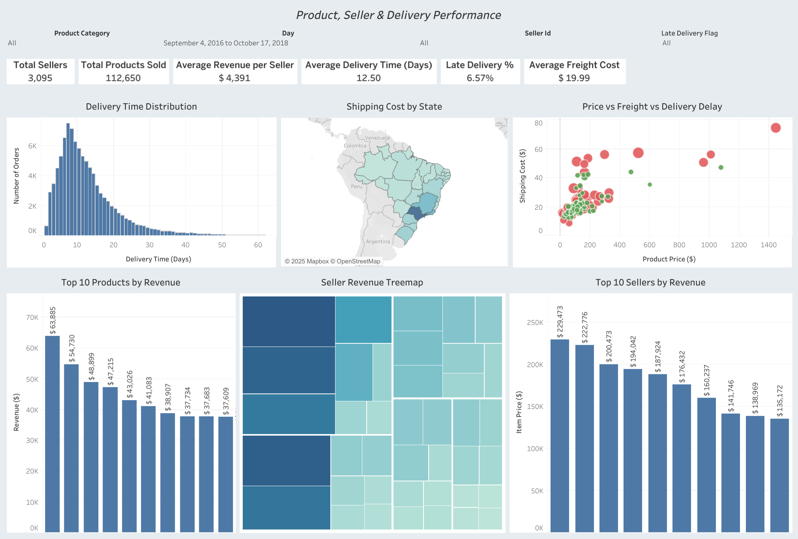

# 📊 Tableau Dashboards – Olist E-Commerce Analytics

This folder contains all Tableau dashboards created for the **Olist E-Commerce Analytics Project**.  
The dashboards are built using a cleaned and transformed PostgreSQL dataset and focus on:

• Sales performance  
• Customer behavior  
• Seller performance  
• Delivery efficiency  
• Logistics cost analysis  

---

## ✅ Dashboard 1 – Executive Sales & Customer Overview

🔗 **Live Dashboard Link:**  
https://public.tableau.com/shared/9Y5269RD9

### 📌 Key KPIs
- Total Orders
- Total Revenue
- Total Customers
- Average Order Value (AOV)
- Repeat Customer Rate

### 📈 Visualizations Included
- Monthly Revenue & Orders Trend  
- Sales by State (Map)  
- Orders by Order Status  
- Top Product Categories by Revenue  
- Customer Concentration by State  

🖼️ **Preview**

---

## ✅ Dashboard 2 – Product, Seller & Delivery Performance

🔗 **Live Dashboard Link:**  
https://public.tableau.com/views/ProductSellerDeliveryPerformance/ProductSellerDeliveryPerformance

### 📌 Key KPIs
- Total Sellers
- Total Products Sold
- Average Revenue per Seller
- Average Delivery Time
- Late Delivery Percentage
- Average Freight Cost

### 📈 Visualizations Included
- Delivery Time Distribution  
- Shipping Cost by State  
- Price vs Freight vs Delivery Delay  
- Top 10 Products by Revenue  
- Seller Revenue Treemap  
- Top 10 Sellers by Revenue  

🖼️ **Preview**

---

## 🛠 Tools Used
- Tableau Public  
- PostgreSQL  
- SQL  
- Python  
- GitHub  

---

## 🎯 Business Value
These dashboards provide actionable insights into:
- Revenue concentration risk
- Delivery inefficiencies
- Seller performance gaps
- Regional shipping cost differences
- Customer purchasing behavior

They are designed for **executives, operations managers, and business analysts**.

---

✅ **Created by:** Sajith Pemarathna  
✅ **Project:** Olist E-Commerce Analytics
